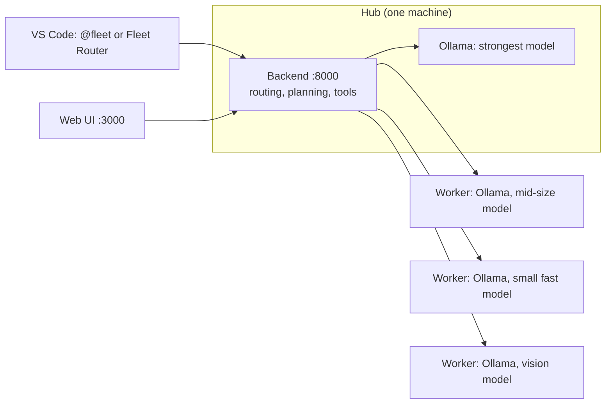

# Agent Fleet

A coding assistant that runs on the computers you already own. It sends each request to whichever of your machines
suits it best, answers with local models served by [Ollama](https://ollama.com), and can read and edit your code, run
commands, search the web and plan larger changes before it touches anything. Nothing is sent to a cloud model.

It is built for a home or small-office network: one strong PC (the hub) plus any older PCs, mini servers or laptops
that can run a small model. It also works on a single machine.



## What you get

- **Routing.** A small model reads each request and picks a machine: a strong one for hard work, a mid-size one for
  ordinary work, a fast one for quick questions. Machines that are off are skipped. With one machine there is no
  routing at all.
- **Real tools.** Read, search, edit, move and write files; see a project at a glance; run commands and git; call
  HTTP APIs; run code in a throwaway Docker container, locally or on another machine over SSH; search and fetch web
  pages. Add more without code: turn a command such as `dotnet test {project}` into a tool, pick an
  [MCP](https://modelcontextprotocol.io) server from a catalog, or bring over the ones you use in VS Code, Claude or
  Cursor. Every tool can be tried from the settings.
- **Plan mode.** Turn it on and the strongest model first explores your code with read-only tools and proposes a plan:
  steps, files, a check for each step, and a diagram. You approve it. Then the plan runs in the background, one step at a
  time, and after each step the fleet itself runs that step's check and retries with the real error. You can go to bed
  and read what happened in the morning. See [docs/planning.md](docs/planning.md).
- **Two front ends.** A web UI, and a VS Code extension with `@fleet` plus a selectable Fleet Router chat model. Both use the same local backend.
- **Setup in the browser.** A checklist that suggests a model for your hardware and downloads it with a progress bar,
  downloads models onto other machines, sets up the code sandbox (including SSH keys), and says what to fix and how.
  Scripts cover the same from a terminal: one sets up the hub, one each extra machine, one checks that everything is
  healthy.

## Requirements

- Windows 10 or 11, Linux, or macOS for the hub. `Setup-Hub.ps1` can install Windows prerequisites; on Linux and macOS,
  install the .NET 9 SDK, Node.js 20+ with npm, and Ollama first, then use `scripts/setup-hub.sh`.
- Any number of other machines running Windows or Linux with [Ollama](https://ollama.com/download).
- On the hub, a graphics card with 8 GB of memory or more is best. Without one, 16 GB of RAM runs the smaller models,
  more slowly.
- The hub needs [Node.js 20+](https://nodejs.org) and [Ollama](https://ollama.com/download). Running from source also
  needs the [.NET 9 SDK](https://dotnet.microsoft.com/download) and npm; a [download](#download) does not. On Windows,
  `Setup-Hub.ps1` offers winget installs; on Linux and macOS, install them before running `setup-hub.sh`.

## Download

Ready-to-run builds are on the [Releases page](https://github.com/miladild/AgentFleet/releases):

| File | What | You need |
|---|---|---|
| `AgentFleet-<version>-win-x64.zip` | The fleet for Windows: backend and web UI, already built | [Node.js 20+](https://nodejs.org) and [Ollama](https://ollama.com) |
| `AgentFleet-<version>-linux-x64.tar.gz` | The same for Linux | Node.js 20+ and Ollama |
| `agent-fleet-chat-<version>.vsix` | The VS Code extension (`@fleet` and Fleet Router) | VS Code with GitHub Copilot Chat |

Unpack the fleet, then double-click **Start Agent Fleet.cmd** (Windows) or run `bash scripts/start-fleet.sh` (Linux). The
web UI opens in your browser, and its **Setup** tab picks a model that suits your computer and downloads it with one
button. The backend brings its own .NET runtime; nothing is built on your machine. `README.md` inside the download has
the details, including starting it at logon. Install the extension from VS Code: Extensions, the `...` menu, **Install
from VSIX**. `SHA256SUMS.txt` lists the checksums.

To change the code, or on macOS, use the source instead:

## Quick start from source (one machine, about 15 minutes, most of it downloading a model)

### Windows

```powershell
git clone https://github.com/miladild/AgentFleet.git
cd AgentFleet
.\scripts\Setup-Hub.ps1
cd agent-fleet
npm run dev
```

Open <http://localhost:3000> and ask something. Full walk-through: [docs/getting-started.md](docs/getting-started.md).

### Linux or macOS

Install the .NET 9 SDK, Node.js 20+ with npm, and Ollama from their official download pages, then:

```sh
git clone https://github.com/miladild/AgentFleet.git
cd AgentFleet
bash scripts/setup-hub.sh
cd agent-fleet
npm run dev
```

Open <http://localhost:3000>. The Unix script builds the backend and prepares local config, but does not install system
packages or change firewall and listening-address settings.

## Add more machines

On each extra machine:

```powershell
.\scripts\Setup-Worker.ps1 -AllowFrom <the hub's address>      # Windows, elevated PowerShell
sudo ./scripts/setup-worker.sh --allow-from <the hub's address>  # Linux
```

Then on the hub:

```powershell
.\scripts\Add-FleetNode.ps1 -Name worker1 -Address <worker address> -Model qwen2.5-coder:7b -Tier standard -Pull
.\scripts\Test-Fleet.ps1
```

Details, including which model suits which machine: [docs/adding-machines.md](docs/adding-machines.md).

## Read this before you expose it to anyone

The fleet has **no login and no approval step**. Anything that can reach the backend can make it read your files and run
commands with your account's permissions. It is designed for a network you trust, bound to your own machine by default,
and it must never be reachable from the internet. Plan mode is the safety valve: it makes the assistant look and propose
before it acts. [docs/security.md](docs/security.md) explains the exact exposure and how to keep it small.

## Documentation

| | |
|---|---|
| [Getting started](docs/getting-started.md) | Install, first run, first questions |
| [Adding machines](docs/adding-machines.md) | Workers, models, tiers, vision, firewalls |
| [Plan mode](docs/planning.md) | Plan first, approve, run overnight, read the result |
| [Durable context](docs/context.md) | What the fleet remembers across machines, front ends and restarts, and how to pin a decision |
| [Tools and MCP](docs/tools-and-mcp.md) | What the assistant can do, adding your own tools |
| [Configuration](docs/configuration.md) | Every setting in `fleet.config.json` and the environment |
| [Security](docs/security.md) | What is exposed, and how to keep it small |
| [Troubleshooting](docs/troubleshooting.md) | A machine turns red, the model is slow, and other common problems |
| [Architecture](docs/architecture.md) | How it works, for people changing the code |
| [Scripts](scripts/README.md) | What each script does |
| [VS Code extension](vscode-fleet/README.md) | `@fleet` and Fleet Router in the model picker |

## Layout

```
agent-fleet/     the backend (.NET, agent/) and the web UI (Next.js, src/)
  agent.Tests/   unit tests for the backend
vscode-fleet/    the @fleet and Fleet Router extension for VS Code
scripts/         setup, deploy and health-check scripts
docs/            documentation
```

## Status

A working personal project, used daily on one home network. Expect rough
edges: the routing model is a small classifier that sometimes guesses wrong, and small local models need retries. Windows
hub setup can install prerequisites; Linux and macOS hub setup expects them to be installed first.

## License

[MIT](LICENSE).
