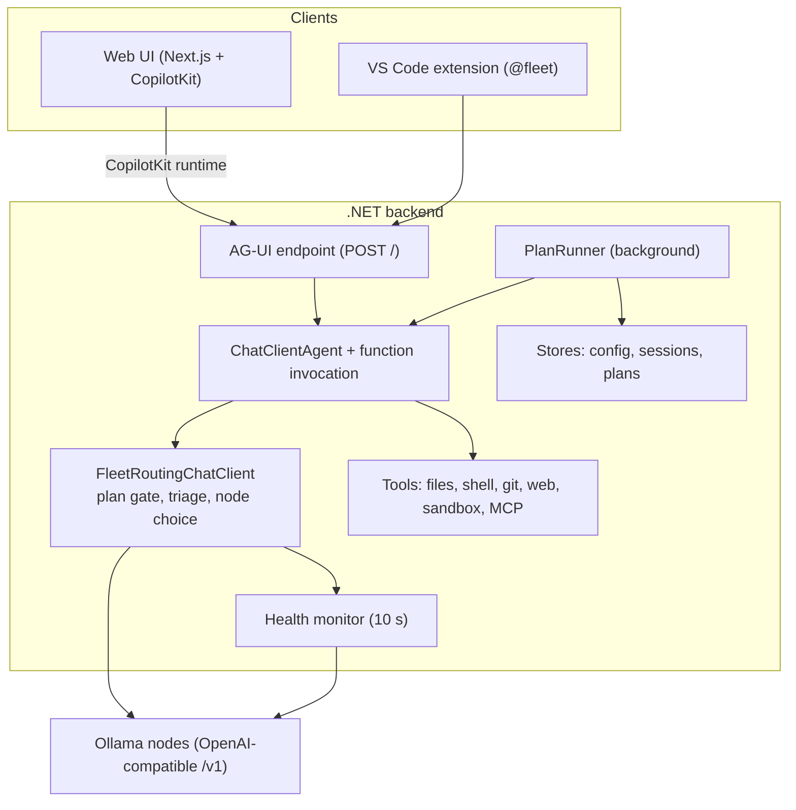

# Architecture

For people changing the code. Users do not need this page.

## Pieces



| Folder | What |
|---|---|
| `agent-fleet/agent/` | The backend: ASP.NET Core minimal API, Microsoft Agent Framework (`ChatClientAgent`), AG-UI server |
| `agent-fleet/agent.Tests/` | xUnit tests |
| `agent-fleet/src/` | The web UI: Next.js App Router, CopilotKit sidebar, a few API proxy routes |
| `agent-fleet/scripts/` | Dev run scripts, the UI launcher, the headless Mermaid checker |
| `vscode-fleet/` | The VS Code chat participant |
| `scripts/` | Setup, deploy and health-check scripts |

## A request, end to end

1. The client posts an AG-UI run to `POST /` with the conversation and any client-declared tools (VS Code sends its own).
2. `ChatClientAgent` calls its chat client, which is `FleetRoutingChatClient` wrapped in a function-invocation layer. That
   layer runs tool calls by name, with a per-request cap of 200 iterations and detailed errors (small models need to see
   the real error to correct themselves).
3. `FleetRoutingChatClient` decides where the call goes:
   - It works out the **plan phase** from the messages (see below).
   - Images in the conversation go to a vision node; with no vision node they are stripped.
   - Planning always goes to the heavy tier. A runner request goes to its step's tier. Otherwise the triage model, run on
     the fallback node, picks a node (the prompt is generated from the tiers actually present; with one text node, triage is
     skipped).
   - It picks a client for that node. Each node client is a `ResilientChatClient` (health-aware, falls back to the fallback
     node on failure) around a `ToolCallRescueChatClient` (repairs a known Ollama bug where the `qwen3-coder` parser leaks a
     tool call as text) around an OpenAI-compatible client.
4. Streamed updates pass back through `GuardCalls`, which rewrites any disallowed tool call while planning.
5. The router appends `via <node>` to the answer.

The backend is **stateless per request**: the client sends the whole conversation each time. Sessions are saved by clients
through `/api/sessions`, not needed by the backend to answer.

The VS Code participant adds bounded, untrusted editor context (attachments,
selections and the active editor path) before posting the request. It invokes
VS Code tools through `vscode.lm.invokeTool` with the chat invocation token, so
tools can request VS Code's native confirmation UI. `/api/fleet-tools` exposes
only enabled fleet MCP tool descriptions and schemas for safe duplicate
detection; it does not return MCP URLs, headers or the full config.

## Configuration as data

`FleetConfigStore` loads `fleet.config.json`, normalizes it (default tiers, one fallback, `/v1` on addresses), validates it,
and persists changes. `Current` is a lock-free read; writers take a lock. Nodes, tools, MCP servers and the sandbox are read
once at startup and baked into the clients and the agent's tool list. Mode and plan mode are read per request.

## Plan mode

- **Files.** `PlanModels.cs`, `FleetPlanStore.cs` (a plan is `plans/<id>.json` plus a `.md`), `PlanTools.cs` (`propose_plan`,
  `get_plan`), `PlanGate.cs`, `PlanRunner.cs`, `DiagramValidator.cs`.
- **Phase is derived, not stored.** `PlanGate.Evaluate` finds a `[plan:<id>]` marker in the conversation (put there by the plan
  tool result or the approval message) and combines it with the stored plan status: `Planning`,
  `Executing` (`Off` when plan mode is off). While a plan awaits approval the phase is still `Planning`. Any client works
without server-side conversation state.
- **Three layers stop writes while planning.** The tool list offered to the model is filtered; `GuardCalls` rewrites a call
  to a disallowed tool into `blocked_by_plan_mode`; and the function-invocation layer re-checks at execution time with the
  whole conversation. The first layer alone leaked in testing, because the invocation layer runs any call by name.
- **Execution is code, not conversation.** `PlanRunner` takes approved plans from a queue, one plan at a time. Steps are
  sequential by default. Consecutive steps explicitly marked in the same `parallelGroup` can have their first model
  attempts run together only when their project-local file paths are disjoint and their distinct tiers have ready nodes.
  Checks run after all group edits finish; retries run sequentially. Each attempt includes bounded text context from the
  step's named project-local files; the prompt labels their contents as untrusted data. State lives in the plan file, so
  a restart resumes. Requests from the runner carry
  `fleet.runner.tier` in `ChatOptions.AdditionalProperties` and bypass the gate.
- **Project export is explicit.** The web plan card can save an approved Markdown snapshot under
  `<project>/.agent-fleet/plans/<id>.md`. The checkbox is off by default; chat and VS Code approvals do not export.
- **Why not let the model report progress?** It was tried: a small model wrote the files, never called the completion tool,
  and drifted into unrelated work. The completion decision moved into code.
- **Tool arguments are parsed leniently.** Models send list arguments as strings and whole arrays as JSON text.
  `propose_plan` takes raw `JsonElement`s and normalizes them. A raw `JsonElement` parameter needs a `[Description]`, or
  Ollama rejects the schema (`true` is not an object); optional parameters need `= null` or they are marked required.
- **Diagrams** are validated by a child Node process (Mermaid plus a jsdom shim) exposed by the web app at
  `/api/validate-diagram`; the backend fails open if the web app is unreachable. `DiagramSanitizer` quotes labels with
  parentheses, the commonest error of small models. The ordinary chat Markdown renderer uses Streamdown's Mermaid
  fence renderer with Mermaid's strict security level. The read-only `validate_diagram` tool exposes the same parser
  and sanitizer outside plan creation.
- **Morning plan notice.** `PlansPanel` polls the persisted plan summaries and shows an in-app notice for done or blocked
  plans updated in the last 36 hours. Dismissals are stored in browser `localStorage`, keyed by plan, status, and update
  time, so closing the app does not lose an unread result and an intentional retry can notify again.

## Durable context

Everything a conversation does is appended to one SQLite journal (`FleetContextStore`, WAL mode), and each model call gets a
small projection of it.

- **Identity.** The AG-UI `threadId` is the context id when it is a hyphenated GUID (`FleetContextMiddleware` reads it without
  consuming the body and puts it in an `AsyncLocal`, `FleetRequestContext`). Any other thread id is simply not journaled.
  A client that joins a conversation with a message list of its own (the VS Code model picker linked with "Continue a fleet
  chat") sends `forwardedProps.fleetTranscript: "journal"`: its messages are journaled without replacing the visible
  transcript, and the assembled block then includes the conversation's latest turns.
- **Writing.** `FleetContextJournal` records routes and assistant output (from `FleetRoutingChatClient`), executed tool calls
  and results (from the function invoker in `Program.cs`), and pinned decisions. The run's transcript is upserted by the
  middleware (idempotent by message id and content hash). Every method is best effort and never throws.
- **Reading.** `ContextAssembler` builds the block (pinned facts, handoff, artifact status, summary, recent failures) in a
  fixed order with a size budget; `FleetRoutingChatClient` inserts it after the leading system messages
  (`ContextInjection.Apply`) and the journal records what it inserted. `ContextCompactor` writes rule-based, versioned
  summaries without deleting anything.
- **Plans.** `PlanContextRecorder` gives a plan a context (the chat's, if proposed there), a task per step, verification
  events, hashed artifacts for each step's files, drift detection (`RecordArtifactDivergences`), a `HandoffEnvelope` at each
  step boundary, and checkpoints. The runner sets the step's identity around each model attempt so everything the model does
  lands under that step's task. `PlanTools.TryCompleteStepAsync` refuses a step whose declared new files do not exist.
- **Sessions** are the chats of the journal (`/api/sessions*`); old JSON sessions are imported once per file.
- **Retention.** `ContextRetention` trims each context to its newest delivered blocks and, when `history.deleteAfterDays` is
  set, deletes contexts idle that long except those an unfinished plan uses (`FleetPlanStore.UnfinishedContextIds`).
  `ContextRetentionService` runs it every six hours. Connections use `secure_delete`, and every delete checkpoints and
  truncates the WAL, so deleted text does not stay in the files; a manual cleanup also runs `VACUUM`.

See [context.md](context.md) for the user-facing description.

## Security-relevant code

- `RequestGuard.cs` rejects requests to unknown host names and browser requests from other origins.
- `HubFileSystemTools.cs` and `HubShellTools.cs` have no path or command restrictions by design (see
  [security.md](security.md)). `DockerSandboxExecutor.cs` is the one place with a real boundary.
- Nothing here reads or stores credentials. MCP secrets come from environment variables through `${env:NAME}`.

## Tests

```powershell
cd agent-fleet\agent.Tests
dotnet test
```

The tests cover the file tools, config loading and validation, routing prompt and route parsing, tool-call rescue, MCP helpers,
the plan store, gate, tools, runner and prompts, the request guard, and the sandbox options. Real-model behavior (routing
quality, plan quality) is not unit-testable; it was checked by hand against local models and is described in the plan
documentation. The web UI has no automated tests; changes to it were checked in a browser.

## Building blocks worth knowing

- **AG-UI** ([ag-ui-protocol](https://github.com/ag-ui-protocol/ag-ui)) is the streaming protocol between the UI and the agent.
  CopilotKit is the React side.
- **Microsoft Agent Framework** provides `ChatClientAgent` and the AG-UI hosting package.
- **`Microsoft.Extensions.AI`** provides `IChatClient`, `FunctionInvokingChatClient` and `AIFunctionFactory`. Most of the
  routing and guarding logic is `DelegatingChatClient` layers around it.
- **ModelContextProtocol** (the official C# SDK) is the MCP client.
